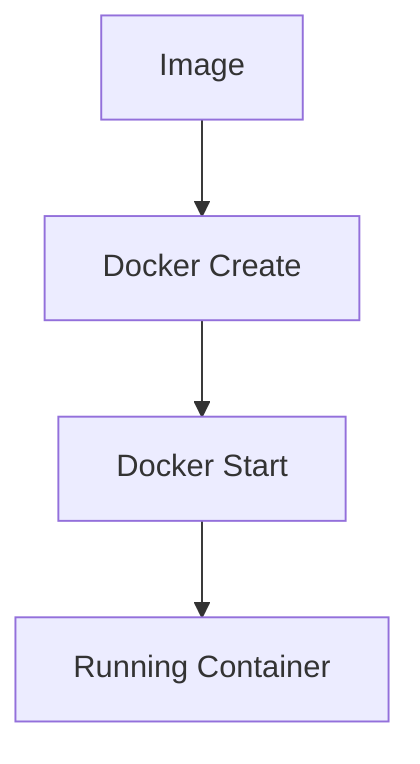

# 🐳 Docker – Simple & Practical Notes

---

## ❓ Why Docker?

Docker makes it **easy to install and run software** without worrying about:
- OS differences
- Library versions
- Dependency conflicts

👉 “It works on my machine” problems mostly disappear.

---

## 🧠 What is Docker?

Docker is a **platform (ecosystem)** for:
- Creating
- Running
- Managing **containers**

### Key Ideas
- **Image** → Blueprint / Template
- **Container** → Running instance of an image
- A container is a **program with its own isolated environment**

---

## 🧩 How Docker Works (High Level)


- Docker CLI talks to **Docker Daemon**
- Daemon pulls images from **Docker Hub**
- Image is instantiated as a **Container**

---

## 🧪 What Problem Does Docker Solve?

### Scenario:
You want to run **two apps**
- App A needs **Python 2**
- App B needs **Python 3**

Without Docker → ❌ conflicts  
With Docker → ✅ each app runs in its **own container**

---

## 🧱 Linux Concepts Behind Docker

Docker uses Linux kernel features:

### 1. Namespaces
- Isolate processes
- Each container feels like it has its own OS

### 2. Control Groups (cgroups)
- Limit CPU, memory, disk usage

👉 Docker Desktop installs a **Linux VM**, because these features are Linux-specific.

---

## 📦 Docker = Create + Start

```text
docker run = docker create + docker start
```



- **Create** → prepares container (filesystem, configs)
- **Start** → runs the startup command

---

## 🔧 Common Docker Commands

### Installation & Info
```bash
brew install --cask docker
docker --version
docker login
```

### Running Containers
```bash
docker run <image_name>
docker run <image_name> <command>
```

### Container Management

| Command | Purpose |
|------|-------|
| docker ps | List running containers |
| docker ps --all | List all containers |
| docker start <container> | Start stopped container |
| docker stop <id> | Graceful stop |
| docker kill <id> | Force stop |
| docker logs <id> | View logs |
| docker system prune | Remove unused data |

---

## 🔑 Execute Commands Inside Containers

```bash
docker exec -it <container_name> <command>
```

- `-i` → interactive input
- `-t` → terminal output

### Open shell inside container
```bash
docker exec -it <container_name> sh
```

---

## 🏗️ Creating a Docker Image


### Dockerfile Example

```Dockerfile
FROM alpine
RUN apk add --update redis
CMD ["redis-server"]
```

- `FROM` → base image
- `RUN` → commands during build
- `CMD` → command at container startup

---

## 🔨 docker build Explained

```bash
docker build .
```

What happens:
1. Reads Dockerfile
2. Executes instructions step-by-step
3. Creates intermediate containers
4. Produces final image

### Intermediate Containers
- Temporary
- Used to build image layers
- Enable caching

---

## ⚡ Docker Build Cache

- Docker caches each build step
- If a step doesn't change → reused
- Faster rebuilds

Only changed steps are rebuilt.

---

## 🏷️ Tagging Images

```bash
docker build -t <docker_id>/<project_name>:latest .
```

Used for:
- Versioning
- Pushing to Docker Hub

---

## 🔁 Container → Image

You can:
1. Run a container
2. Modify it
3. Save it as an image

Useful for experiments and debugging.

---

## 🧠 Quick Recall

- Image → Recipe
- Container → Running dish
- Dockerfile → Instructions
- Docker Hub → Image store
- docker run → create + start

---

✅ End of Notes
