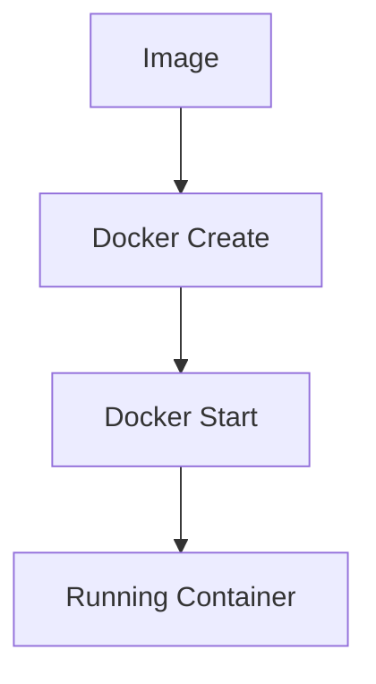

# 🐳 Docker – Simple & Practical Notes

---

## ❓ Why Docker?

Docker makes it **easy to install and run software** without worrying about:
- OS differences
- Library versions
- Dependency conflicts

👉 “It works on my machine” problems mostly disappear.

---

## 🧠 What is Docker?

Docker is a **platform (ecosystem)** for:
- Creating
- Running
- Managing **containers**

### Key Ideas
- **Image** → Blueprint / Template
- **Container** → Running instance of an image
- A container is a **program with its own isolated environment**

---

## 🧩 How Docker Works (High Level)


- Docker CLI talks to **Docker Daemon**
- Daemon pulls images from **Docker Hub**
- Image is instantiated as a **Container**

---

## 🧪 What Problem Does Docker Solve?

### Scenario:
You want to run **two apps**
- App A needs **Python 2**
- App B needs **Python 3**

Without Docker → ❌ conflicts  
With Docker → ✅ each app runs in its **own container**

---

## 🧱 Linux Concepts Behind Docker

Docker uses Linux kernel features:

### 1. Namespaces
- Isolate processes
- Each container feels like it has its own OS

### 2. Control Groups (cgroups)
- Limit CPU, memory, disk usage

👉 Docker Desktop installs a **Linux VM**, because these features are Linux-specific.

---

## 📦 Docker = Create + Start

```text
docker run = docker create + docker start
```



- **Create** → prepares container (filesystem, configs)
- **Start** → runs the startup command

---

## 🔧 Common Docker Commands

### Installation & Info
```bash
brew install --cask docker
docker --version
docker login
```

### Running Containers
```bash
docker run <image_name>
docker run <image_name> <command>
```

### Container Management

| Command | Purpose |
|------|-------|
| docker ps | List running containers |
| docker ps --all | List all containers |
| docker start <container> | Start stopped container |
| docker stop <id> | Graceful stop |
| docker kill <id> | Force stop |
| docker logs <id> | View logs |
| docker system prune | Remove unused data |

---

## 🔑 Execute Commands Inside Containers

```bash
docker exec -it <container_name> <command>
```

- `-i` → interactive input
- `-t` → terminal output

### Open shell inside container
```bash
docker exec -it <container_name> sh
```

---

## 🏗️ Creating a Docker Image


### Dockerfile Example

```Dockerfile
FROM alpine
RUN apk add --update redis
CMD ["redis-server"]
```

- `FROM` → base image
- `RUN` → commands during build
- `CMD` → command at container startup

---

## 🔨 docker build Explained

```bash
docker build .
```

What happens:
1. Reads Dockerfile
2. Executes instructions step-by-step
3. Creates intermediate containers
4. Produces final image

### Intermediate Containers
- Temporary
- Used to build image layers
- Enable caching

---

## ⚡ Docker Build Cache

- Docker caches each build step
- If a step doesn't change → reused
- Faster rebuilds

Only changed steps are rebuilt.

---

## 🏷️ Tagging Images

```bash
docker build -t <docker_id>/<project_name>:latest .
```

Used for:
- Versioning
- Pushing to Docker Hub

---

## 🔁 Container → Image

You can:
1. Run a container
2. Modify it
3. Save it as an image

Useful for experiments and debugging.

---

## 🧠 Quick Recall

- Image → Recipe
- Container → Running dish
- Dockerfile → Instructions
- Docker Hub → Image store
- docker run → create + start

---


# 🐳 Docker Notes -- Node.js Application Explained

------------------------------------------------------------------------

## 📦 Dockerfile

``` dockerfile
FROM node:14-alpine
WORKDIR /usr/app
COPY ./package.json ./
RUN npm install
COPY ./ ./
CMD ["npm", "start"]
```

------------------------------------------------------------------------

## 🔍 Detailed Explanation

### 1️⃣ FROM node:14-alpine

-   Uses **Node.js version 14**
-   Based on **Alpine Linux** (lightweight & small image size)
-   Node and npm are pre-installed
-   Acts as the **base image** for our application

👉 This defines the environment your app runs in.

------------------------------------------------------------------------

### 2️⃣ WORKDIR /usr/app

-   Sets the working directory inside the container
-   If the directory doesn't exist, Docker creates it
-   All subsequent instructions execute inside this folder

Equivalent to:

``` bash
mkdir /usr/app
cd /usr/app
```

------------------------------------------------------------------------

### 3️⃣ COPY ./package.json ./

-   Copies `package.json` from your local machine into the container
-   Placed inside `/usr/app`

👉 This is done separately to improve **Docker layer caching**.

------------------------------------------------------------------------

### 4️⃣ RUN npm install

-   Installs dependencies listed in `package.json`
-   Creates `node_modules` inside the container
-   Executed during **build time**, not runtime

------------------------------------------------------------------------

### 5️⃣ COPY ./ ./

-   Copies the entire project source code into the container
-   Includes:
    -   Application files
    -   Routes
    -   Configuration files

------------------------------------------------------------------------

### 6️⃣ CMD \["npm", "start"\]

-   Defines the default command when the container starts
-   Executes:

``` bash
npm start
```

-   Runs during **container runtime**
-   Typically starts your Express / Node server

------------------------------------------------------------------------

## ⚡ Why Copy package.json First?

Docker builds images in layers and uses caching.

If: - Only source code changes → `npm install` does NOT run again -
`package.json` changes → dependencies reinstall

This makes rebuilds much faster.

------------------------------------------------------------------------

## 🚀 Running the Container

``` bash
docker run -p 3000:3000 my-app-name
```

### 🔎 Understanding -p 3000:3000

Format:

    hostPort:containerPort

-   Left side (3000) → Port on your local machine
-   Right side (3000) → Port inside the container

So when you open:

    http://localhost:3000

Docker forwards traffic from your machine to the container's
application.

------------------------------------------------------------------------

## 🧠 Quick Summary

-   FROM → Base runtime environment\
-   WORKDIR → Set working directory\
-   COPY → Copy files into container\
-   RUN → Execute during build time\
-   CMD → Execute during runtime\
-   -p → Expose container port to host

------------------------------------------------------------------------
# 🐳 Docker Compose -- Complete Notes

------------------------------------------------------------------------

## 📌 What is Docker Compose?

Docker Compose is used to:

-   Start multiple containers at the same time
-   Define services in a single configuration file
-   Manage multi-container applications easily

Instead of running multiple `docker run` commands manually, we define
everything inside a **docker-compose.yml** file.

------------------------------------------------------------------------

## 🧠 Why Docker Compose?

Example Scenario:

You have: - Node.js app - Redis - Database

Without Compose → You must start each container manually.\
With Compose → One command starts everything.

------------------------------------------------------------------------

# 📄 docker-compose.yml Explained

``` yaml
version: '3'

services:
  redis-server:
    image: redis

  node-app:
    restart: always
    build: .
    ports:
      - "4001:8081"
```

------------------------------------------------------------------------

## 🔍 Line-by-Line Explanation

### 1️⃣ version: '3'

-   Defines Compose file format version
-   Version 3 is commonly used
-   Determines supported features

------------------------------------------------------------------------

## 2️⃣ services:

-   Defines all containers for the application
-   Each service = one container

------------------------------------------------------------------------

## 🔴 redis-server Service

``` yaml
redis-server:
  image: redis
```

-   Service name: `redis-server`
-   Uses official Redis image from Docker Hub
-   No build needed (prebuilt image)

Docker automatically pulls the image if not available locally.

------------------------------------------------------------------------

## 🟢 node-app Service

``` yaml
node-app:
  restart: always
  build: .
  ports:
    - "4001:8081"
```

### restart: always

Defines container restart policy.

Available policies:

-   no → Do not restart
-   always → Always restart if stopped
-   on-failure → Restart only if container exits with error
-   unless-stopped → Restart unless manually stopped

------------------------------------------------------------------------

### build: .

-   Builds image using Dockerfile in current directory
-   Equivalent to running: docker build .

------------------------------------------------------------------------

### ports:

``` yaml
- "4001:8081"
```

Format: hostPort:containerPort

-   4001 → Port on your machine
-   8081 → Port inside container

Opening: http://localhost:4001

Forwards to container port 8081.

------------------------------------------------------------------------

# 🚀 Docker Compose Commands

### Start all services

docker-compose up

-   Builds (if needed)
-   Creates containers
-   Starts all services
-   Shows logs in terminal

------------------------------------------------------------------------

### Build and start

docker-compose up --build

-   Forces rebuild of images
-   Useful when Dockerfile changes

------------------------------------------------------------------------

### Run in background

docker-compose up -d

-   Runs in detached mode
-   Terminal is free

------------------------------------------------------------------------

### Stop and remove everything

docker-compose down

-   Stops containers
-   Removes containers
-   Removes networks

------------------------------------------------------------------------

# 🔄 Restart Policies Summary

Policy           Meaning
  ---------------- ---------------------------------
no               Never restart
always           Always restart
on-failure       Restart only on crash
unless-stopped   Restart unless manually stopped

------------------------------------------------------------------------

# 🧠 How Compose Works Internally

When you run:

docker-compose up

Compose:

1.  Creates a network
2.  Builds images (if needed)
3.  Creates containers
4.  Connects them via internal network
5.  Starts them

Containers can communicate using service names:

Example: Node app can access Redis using: redis-server:6379

------------------------------------------------------------------------

# ⚡ Quick Summary

-   Docker Compose → Manage multi-container apps
-   services → Define containers
-   build → Build image from Dockerfile
-   image → Use prebuilt image
-   ports → Expose container ports
-   restart → Auto-restart behavior
-   up → Start services
-   down → Stop & remove services

------------------------------------------------------------------------

# 🐳 Advanced Docker Notes -- Dev Files, Volumes & Attach

------------------------------------------------------------------------

# 📁 Custom Dockerfile (Dev vs Production)

In real projects, we usually maintain:

-   Dockerfile → Production
-   Dockerfile.dev → Development

Why?

Development needs: - nodemon - hot reload - debugging tools

Production needs: - optimized build - minimal dependencies - smaller
image size

------------------------------------------------------------------------

## 🧪 Example

Dockerfile (Production)

``` dockerfile
FROM node:14-alpine
WORKDIR /app
COPY package.json .
RUN npm install --only=production
COPY . .
CMD ["npm", "start"]
```

Dockerfile.dev (Development)

``` dockerfile
FROM node:14-alpine
WORKDIR /app
COPY package.json .
RUN npm install
COPY . .
CMD ["npm", "run", "dev"]
```

------------------------------------------------------------------------

## 🔨 Building with Custom Dockerfile

``` bash
docker build -f Dockerfile.dev .
```

Explanation:

-   -f → specify custom Dockerfile
-   Dockerfile.dev → file to use
-   . → build context

Without -f, Docker uses default file named Dockerfile.

------------------------------------------------------------------------

# 📦 Docker Volumes

By default:

COPY . .

This copies a snapshot of your code into the container.

Problem: If you change code → container does NOT update automatically.

------------------------------------------------------------------------

## 🧠 What is a Volume?

A volume is a reference (link) between:

-   Host folder
-   Container folder

Instead of copying files, Docker maps them.

------------------------------------------------------------------------

## 📌 Example Using docker run

``` bash
docker run -v /app/node_modules -v $(pwd):/app <image_id>
```

Explanation:

-   -v /app/node_modules\
    → Prevents overwriting node_modules inside container

-   -v \$(pwd):/app\
    → Maps current folder to /app inside container

\$(pwd) → Current directory path

Result:

Changes in your local project reflect instantly inside container.

Perfect for development.

------------------------------------------------------------------------

# 🐳 Using Volumes in Docker Compose

Example:

``` yaml
version: '3'

services:
  node-app:
    build:
      context: .
      dockerfile: Dockerfile.dev
    volumes:
      - /app/node_modules
      - .:/app
    ports:
      - "3000:3000"
```

------------------------------------------------------------------------

## 🔍 Explanation

build: context: . → current directory dockerfile: Dockerfile.dev →
custom Dockerfile

volumes: - /app/node_modules → anonymous volume - .:/app → map local
folder to container

Now changes in code auto reflect.

------------------------------------------------------------------------

# 🔗 Docker Attach

## What is docker attach?

docker attach connects your terminal to:

-   STDIN
-   STDOUT
-   STDERR

of a running container.

------------------------------------------------------------------------

## Example

Start container:

``` bash
docker run -it ubuntu
```

In another terminal:

``` bash
docker attach <container_id>
```

Now you are attached to that container's terminal session.

------------------------------------------------------------------------

## ⚠️ Limitation of docker attach

1.  If you press Ctrl + C → container stops.
2.  Only attaches to main process.
3.  Not ideal for running additional commands.

------------------------------------------------------------------------

## Better Alternative

Use:

``` bash
docker exec -it <container_id> sh
```

This:

-   Opens new shell
-   Does NOT stop container on exit
-   Safer and more flexible

------------------------------------------------------------------------

# 🧠 Quick Summary

-   Use Dockerfile.dev for development
-   Use Dockerfile for production
-   -f flag selects custom Dockerfile
-   Volumes map host folder instead of copying
-   docker attach connects to main process
-   docker exec is safer for interactive work

------------------------------------------------------------------------
✅ End of Notes
